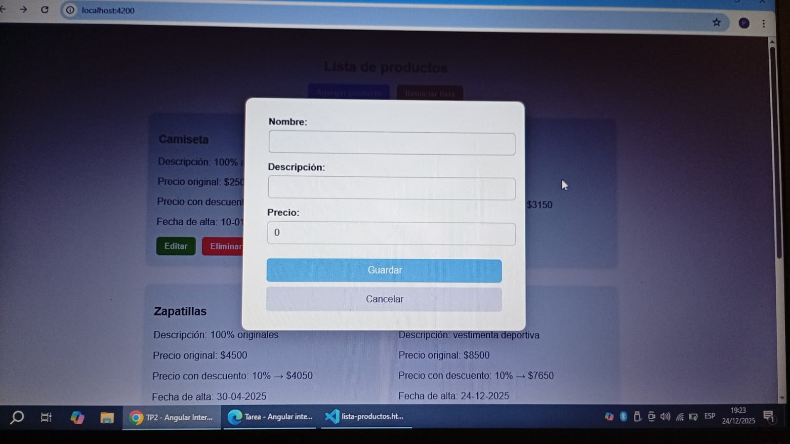
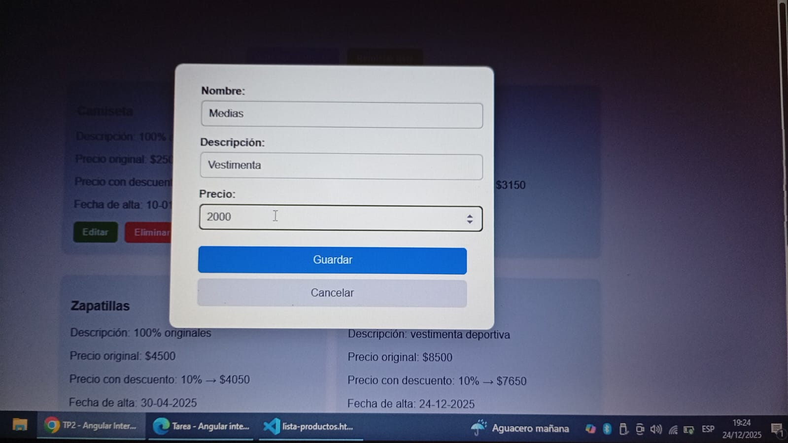
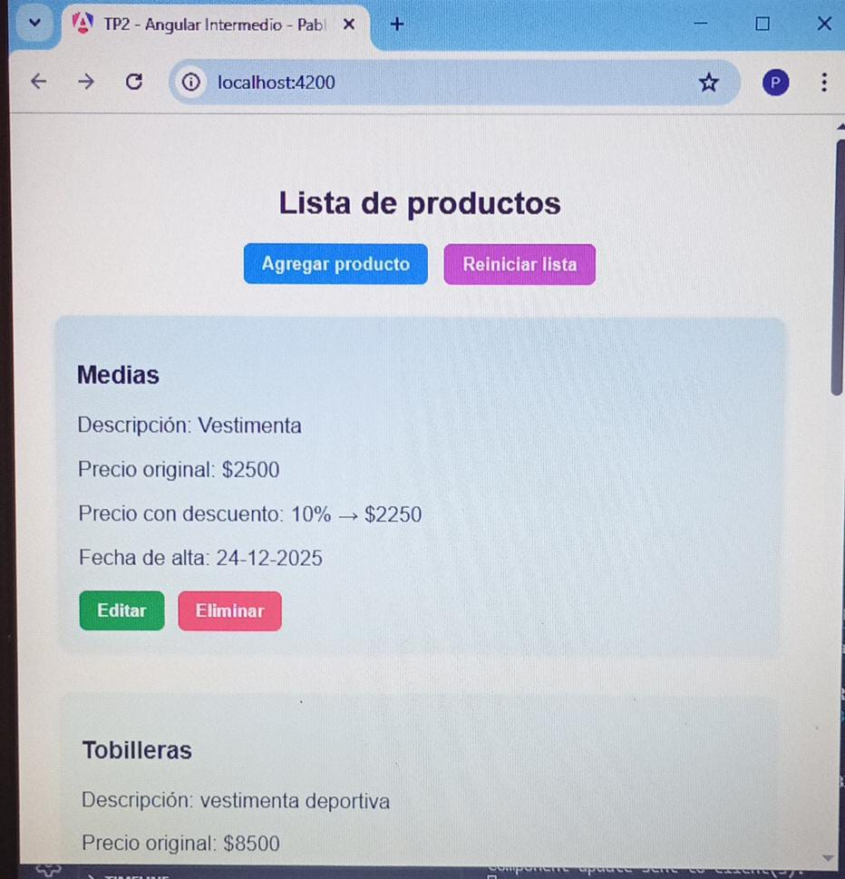
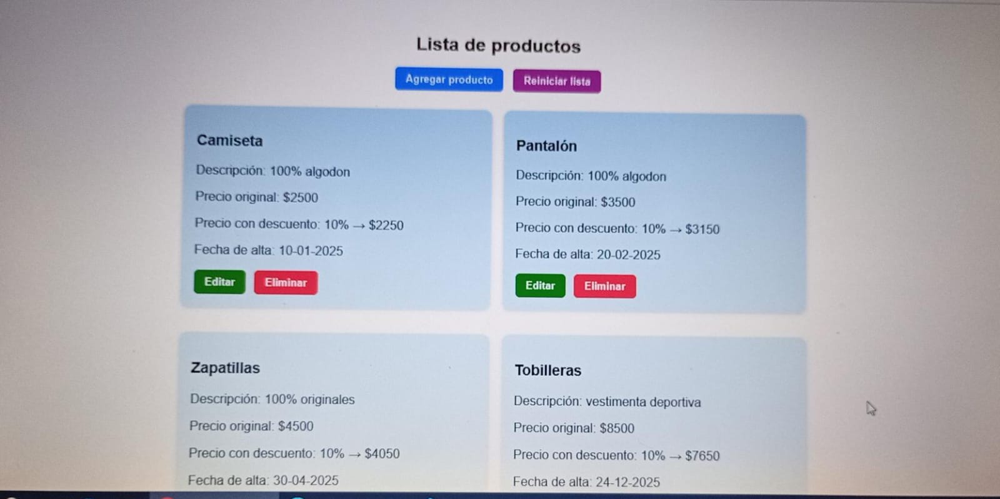

# 🛒 Gestor de Productos - Angular

## 📌 Descripción del proyecto

Aplicación web desarrollada con **Angular** que permite gestionar una lista de productos de forma sencilla e intuitiva.  
Incluye funcionalidades de **alta, edición, eliminación y visualización** de productos, con almacenamiento persistente en **LocalStorage** y notificaciones visuales mediante **Toastify**.

El sistema utiliza componentes standalone, formularios reactivos y un servicio centralizado con `BehaviorSubject` para manejar el estado global de los productos.

---

## ⚙️ Tecnologías utilizadas:

- Angular
- TypeScript
- RxJS
- Formularios Reactivos
- Toastify.js
- HTML / CSS

---

## 🚀 Instrucciones de instalación y ejecución

### 1️⃣ Clonar el repositorio

git clone https://github.com/tu-usuario/tu-repositorio.git
cd tu-repositorio

2️⃣ Instalar dependencias
npm install

3️⃣ Ejecutar la aplicación
ng serve

Luego abrir el navegador en:
http://localhost:4200

🧪 Funcionalidades principales:
➕ Agregar productos
✏️ Editar productos
❌ Eliminar productos
♻️ Restablecer lista inicial
💾 Persistencia de datos con LocalStorage
🔔 Notificaciones visuales con Toastify

## 🖼️ Capturas de Pantalla

👨‍🎓 Créditos
TP2 - Angular intermedio
Autor: Pablo Caparelli
Diplomatura en Professional Full-Stack Developer
Comisión 999201564